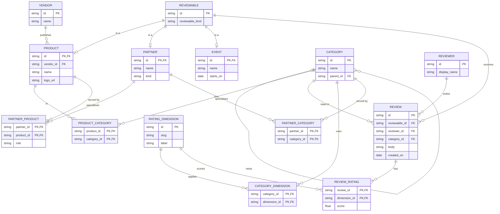

# Part 1 — Core data model

Sketch only. No database in this exercise. Cardinalities are what I would defend in the walkthrough.

`REVIEWABLE.reviewable_kind` is `product` | `partner` | `event`. `PRODUCT.id`, `PARTNER.id`, and `EVENT.id` reuse the `REVIEWABLE` id (joined subtype, 1:1). Exactly one subtype row exists for a reviewable. That is an application invariant, not a second foreign key on `REVIEW`.

---

## The four questions

**1. Several categories, and categories may nest.**  
`CATEGORY.parent_id` is a nullable self-FK: **0..1 parent**, **0..N children**. Root categories have `parent_id = null`, so the parent side is not mandatory. Products sit in many categories through `PRODUCT_CATEGORY` (`M:N`). Nesting is a tree, not a DAG: at most one parent keeps breadcrumbs and “CRM → Sales CRM” simple. If a category later needs two parents, replace the FK with a category-edge table.

**2. Dimensions differ by category, and stay out of the review.**  
`RATING_DIMENSION` is the catalogue of what we *can* measure (`lead_management`, `deliverability`, `ease_of_use`). `CATEGORY_DIMENSION` says which of those apply to a category. The review itself is text + who + when. Scores live in `REVIEW_RATING` (`REVIEW 1:N REVIEW_RATING`). Adding a CRM-only dimension does not change the review table. A review also stores `category_id`: HubSpot listed under CRM and Marketing is rated with that page’s dimension set, not a blob of mixed scores. Write path should reject a `REVIEW_RATING` whose dimension is not in that category’s set.

**3. Tools, partners, and later events, without copying review machinery.**  
Reviews point at `REVIEWABLE`, not at `PRODUCT` or `PARTNER`. A new type is a new subtype table plus a `reviewable_kind` value. `REVIEW` / `REVIEW_RATING` stay unchanged. Vendor is *not* reviewable: a vendor publishes products (`VENDOR 1:N PRODUCT`). I considered a single table with nullable columns for every type and rejected it. That gets cheaper on day one and expensive the first time events appear.

**4. A partner that specialises in a tool or a category.**  
Two join tables, both `M:N`: `PARTNER_PRODUCT` (for example a HubSpot implementation partner, `role` = implementation | reseller) and `PARTNER_CATEGORY` (specialised in CRM). Specialisation is not the same as “this partner *is* a CRM product”, so it is not reused from `PRODUCT_CATEGORY`.

---

## What I left out

Pricing tiers, feature attributes, and the questionnaire are catalogue or UI concerns (Part 2 seed). They are not required to answer the four questions. Aggregates (average ease of use on a category page) are queries over `REVIEW_RATING`, not extra entities.
